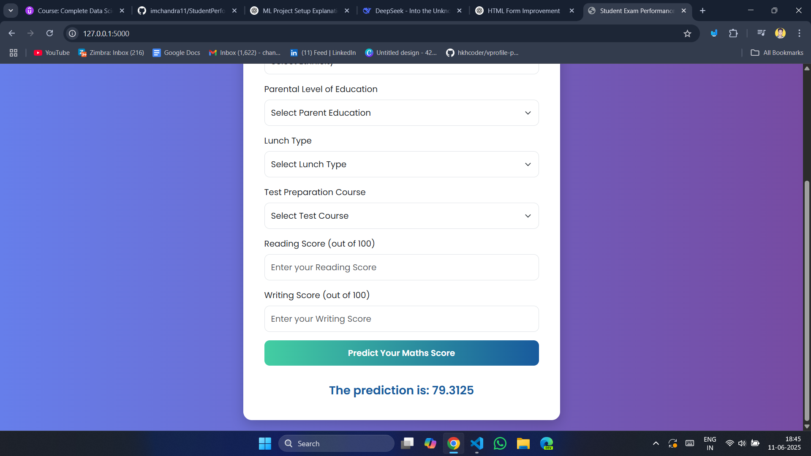

# 📊 Student Performance Analysis

This project aims to **predict the math score** of a student based on various factors like gender, ethnicity, parental level of education, lunch type, test preparation course, reading score, and writing score.

---
##  steps to run project
- clone the repo

- run command- pip install -r reqirements.txt
this will install required libraries and trigger the setup.py so your project will wrap a package.

- run command- python data_ingestion.py
your data will be ingested, train and test csv file will stored in artifact folder
now it will run data_transformation file 
data will be processed using OHE and transformation techniques, will be stored as preprocessor.pkl in artifact folder.
model_trainer file will be run, will store model.pkl file in artifact folder

- run command python app.py
it will run your flask application, can see your interface in browser using http://127.0.0.1:5000


## 🧠 1. Problem Statement

The goal of this project is to understand how a student's performance (test scores) is affected by other variables such as:

- Gender
- Ethnicity
- Parental Level of Education
- Lunch Type
- Test Preparation Course

Using machine learning models, we predict a student’s **math score**.

---

## 📦 2. Dataset

- **Source:** [Kaggle - Student Performance Dataset](https://www.kaggle.com/datasets/spscientist/students-performance-in-exams?datasetId=74977)
- **Shape:** 1000 rows × 8 columns

**Columns:**
- `gender`
- `race/ethnicity`
- `parental level of education`
- `lunch`
- `test preparation course`
- `math score`
- `reading score`
- `writing score`

---

## 🧰 3. Tech Stack

| Purpose                      | Tools & Libraries               |
|-----------------------------|---------------------------------|
| Backend                     | Python, Flask                   |
| ML Models                   | CatBoost, XGBoost, RandomForest, etc. |
| Data Handling               | pandas, numpy                   |
| Web Framework               | Flask                           |
| Frontend Template           | HTML5, CSS3, Bootstrap          |
| Deployment Ready            | Localhost (can be pushed to cloud) |
| Model Evaluation            | R2 Score, Hyperparameter Tuning |
| Model Persistence           | Pickle                          |

---

## 📁 4. Project Structure

```bash```
student-performance-analysis/
│
├── artifacts/                # Stores trained model and preprocessor
│   ├── model.pkl
│   └── preprocessor.pkl
│
├── templates/
│   └── home.html             # Frontend form for prediction
│
├── src/
│   ├── __init__.py
│   ├── exception.py          # Custom exception handling
│   ├── logger.py             # Logging utility
│   ├── utils.py              # save/load object and evaluation logic
│   └── pipeline/
│       ├── predict_pipeline.py
│       └── train_pipeline.py
│
├── app.py                    # Main Flask app
├── requirements.txt
└── README.md
---


## 5. Setup Instructions
⚙️ Step 1: Clone the Repository
git clone https://github.com/your-username/student-performance-analysis.git
cd student-performance-analysis
🐍 Step 2: Create Virtual Environment
bash
Copy
Edit
python -m venv venv
source venv/bin/activate       # for Linux/Mac
venv\Scripts\activate          # for Windows
📦 Step 3: Install Dependencies
bash
Copy
Edit
pip install -r requirements.txt
Make sure catboost, xgboost, flask, scikit-learn, and pandas are installed.


---


## 📊 6. Model Training
### Step 1: Add Dataset
Download the dataset from here.

Save it in a folder like notebooks/data/StudentsPerformance.csv or use your custom path.

### Step 2: Run Training Pipeline
Make sure your train_pipeline.py handles:

Data loading

Preprocessing (LabelEncoding + Scaling)

Model training with multiple regressors

Evaluation using R² score

Saving the best model and preprocessor in the artifacts/ folder

Then simply run:
python src/pipeline/train_pipeline.py
This will save:

model.pkl (trained model)

preprocessor.pkl (transformer)

## 🧠 7. Prediction Pipeline
predict_pipeline.py handles:
Loading saved model and preprocessor

Transforming input features

Predicting the math score

It works with the form in home.html using Flask.

## 🌐 8. Run the Flask App
python app.py
Visit http://127.0.0.1:5000/ in your browser. You’ll see a web form where you can input:

Gender

Ethnicity

Parental education

Lunch type

Test preparation

Reading & Writing scores

Click Predict Your Maths Score and get the predicted value instantly.

## 🖥️ 9. Web Interface
<div align="center">
  
</div>

## 📈 10. Model Details
In ModelTrainer (in model_trainer.py), the following models were trained:

Random Forest Regressor

Decision Tree Regressor

Gradient Boosting

Linear Regression

XGBoost

CatBoost

AdaBoost

Hyperparameter tuning is done using GridSearchCV.

The best model is selected based on R² score.

## 🧪 11. Evaluation Metrics
R² Score is used to evaluate performance.

If no model crosses a threshold (0.6), training throws an exception.

## 🧹 12. Clean Code Architecture
Custom Exception Handling (CustomException)

Centralized Logging (logger.py)

Modular structure: Training, Prediction, Utility, Exception

Clean UI using Bootstrap

## 🔐 13. Future Improvements
Add CI/CD using GitHub Actions

Deploy on AWS/GCP

Add model versioning using MLflow

Use Docker for containerization

## 🙏 14. Credits
Dataset by Kaggle - spscientist

Created with ❤️ by Chandra Prakash

## 📬 Contact
If you face any issues or want to contribute, feel free to reach out-> chandra385123@gmail.com

